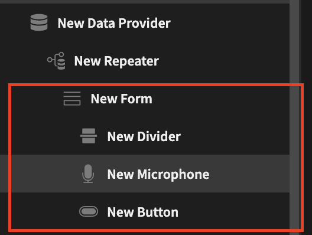
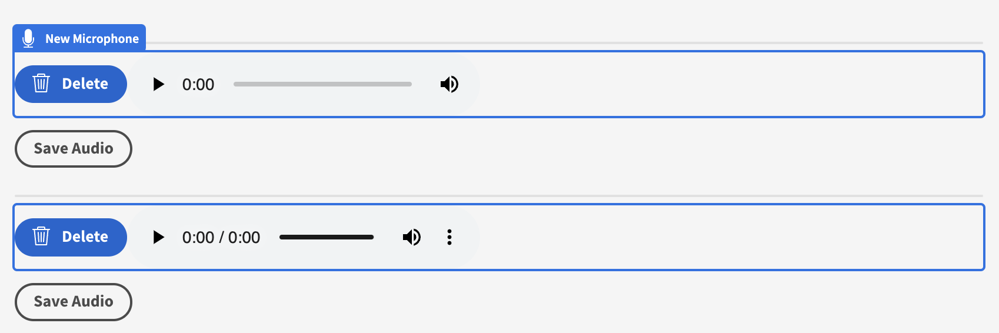

# Form Audio Recorder

# Description
A recorder which allows you to save a recording in a Budibase attachment field.

Set Up Steps-

- Create a table with a Budibase attachment field!

[Table](assets/table.png)
- Add a form to a screen
- Place the Form Audio Recorder Plugin within the form

- Add a button to Save the Row to finish saving the recording to the Budibase table

Find out more about [Budibase](https://github.com/Budibase/budibase).
